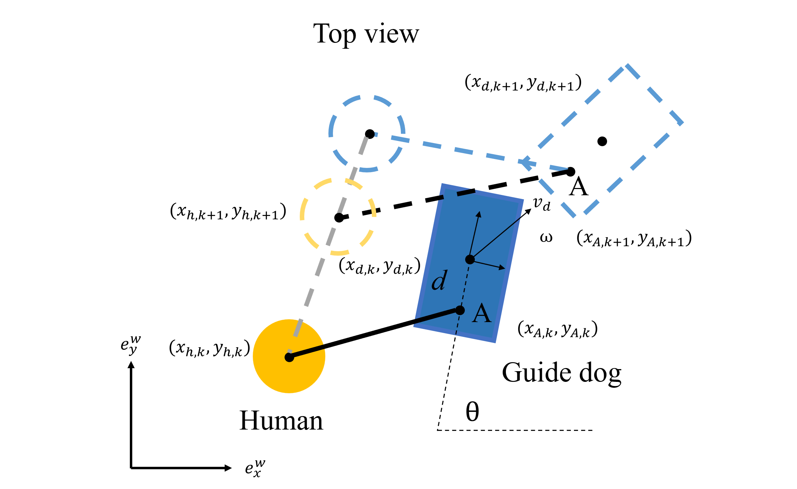

## NMPC-DCBF based Guiding-Leading hybrid control mode 

### Guiding Dog
1. 当有明确目的的时候，由四足机器人来进行引导人进行前进
2. 状态变量为
$$
  (x_h, y_h, x_d, y_d, \theta)
$$
3. 动力学模型

  **在线辨识参数$offset_x, offset_y$?**
3. constrains
   1. 动力学约束
   2. 狗（凸多边形）与静态障碍物的约束
   3. 人（点）与静态障碍物的约束
   4. 输入约束
   5. 状态变量的约束
4. costs
   1. 过程/终点的轨迹跟随cost
   2. 输入cost
   3. smooth cost
### Leading Huamn
1. 当人想要凭借主观意识自主移动时，狗跟随人的移动
2. 状态变量为
$$
  (x_d, y_d, \theta)
$$
1. constrains
   1. 动力学约束
   2. 狗（凸多边形）与静态障碍物的约束
   3. 人（点）与静态障碍物的约束
   4. 输入约束
   5. 状态变量的约束
2. costs
   1. 跟随人的cost
   2. 输入cost
   3. smooth cost

    